# 一、常用优化器类型及选择（optimizer）  -- 优化网络参数
## 1.1 常见优化器算法：
### 1.1.1 GD（梯度下降）
    1）包括三种常见的变形：批量梯段下降（BGD），随机梯度下降（SGD）使用最多，小批量梯度下降（MBGD）。区别在于每次计算梯度时选择样本的数量的方式不同
    2）学习率：所有优化器中算法中最重要的参数，直接影响梯度下降的过程（即步长，stride）、影响模型的学习速度（即收敛速度），过大可能导致在最小值附近来回震荡，无法收敛；国小则学习速度会过慢，初始设置为0.01~0.001为宜
### 1.1.2 Momentum（相比GD,增加了动量变化机制）
### 1.1.3 AdaGrad（自适应，相比GD,增加了学习率递减系数）
### 1.1.4 RMSProp（改良了AdaGrad，增加了衰减系数）
### 1.1.5 Adam（改良了RMSProp，增加了偏移校正） ，通用性最好，在不清楚选择时可以优先使用
后4种都是在GD算法基础上不断优化所得

# 二、常用损失函数的类型及选择（loss）
## 2.1 回归损失函数
### 2.1.1 mean_squared_error (mse) 均方误差，公式为：((y_pred-y_true)**2).mean()
### 2.1.2 mean_absolute_error (mae) 平均绝对误差，公式为：(|y_pred-y_true|).mean()
### 2.1.3 mean_absolute_percentage (mape) 平均绝对百分比误差
### 2.1.4 mean_squared_logarithmic_error (msle) 均方对数误差
## 2.2 分类损失函数
### 2.2.1 hinge：铰链损失函数，主要用于支持向量机（SVM）
### 2.2.2 binary_crossentropy: 二分类损失函数，交叉熵函数
### 2.2.3 categorical_crossentropy: 多酚类损失函数，交叉熵函数
### 2.2.4 sparse_categorical_crossentropy: 同上，多分类损失函数，可接受稀疏标签（无需转one-hot独热编码）

# 三、评价指标的选择（metrics） -- 即评估函数，用于计算模型的成绩，函数的输入为预测值和实际值，位于keras.metrics模块中
## 3.1 分类问题
### 3.1.1 binary_accuracy: 二分类问题，计算所有预测值上的平均正确率
### 3.1.2 categorical_accuracy: 多分类问题，计算所有预测值上的平均正确率
### 3.1.3 sparse_categorical_accuracy: 与categorical_accuracy相同，适用于稀疏标签预测
### 3.1.4 top_k_categorical_accuracy: 计算top-k正确率，当预测值的前k个值中存在目标类别即认为预测正确
### 3.1.5 sparse_top_k_categorical_accuracy： 与top_k_categorical_accuracy相同，适用于稀疏标签预测

# 四、训练时验证集参数的使用
## 4.1 训练集数据 x_train
## 4.2 训练集标签 y_train
## 4.3 训练迭代次数 epochs
## 4.4 批尺寸（每批次为给神经网络的样本数量） batch_size
    history = model.fit(x_train, y_train, epochs=1000, batch_size=800)
    训练时还可以指定验证数据，以更好地验证训练效果，两种方式：直接指定验证集，或从训练集中随机分割一定比例作为验证集
    history = model.fit(x_train, y_train, epochs=1000, batch_size=800, validation_data=(x_val,y_val))
    history = model.fit(x_train, y_train, epochs=1000, batch_size=800, validation_data=0.2)

# 五、卷积神经网络中池化的概念
    池化（也成为下采样或降采样）通过对特征图进行降维，达到减少参数数量、防止过拟合的目的。常用的池化类型有最大池化（Max Pooling）和平均池化（Average Pooling）
## 5.1 卷积层主要参数
    layers.Conv2D(filters,kernel_size,strides=(1,1),padding=‘valid’)
### 5.1.1 filters 卷积核（过滤器）数量（即卷积后产生的特征图数量） 通常逐层增加
### 5.1.2 kernel_size 卷积核尺寸（通常使用（3，3）或（5，5））
### 5.1.3 strides 卷积步长，默认（1，1）
### 5.1.4 padding 边界填充策略，默认valid表示不填充，卷积后特征图变小，same表示填充，卷积后与原图相同 

## 5.2 池化层主要参数
    全部参数默认情况下，池化后特征图变为原图的一半大小（即参数数量减半）
    layers.MaxPooling2D(pool_size=(2,2),strides=None,padding='valid')
### 5.2.1 pool_size 池化窗口的大小 ， 默认（2，2）
### 5.2.2 strides 步长，默认None表示与pool_size相同
### 5.2.3 padding 边界填充策略，默认valid表示不填充，same表示填充，卷积后与原图相同 ，池化后与原图相同

## 5.3 dropout层（可选，可以加在网络中任意位置，通常加在全连接层）
    作用是随机舍弃一定比例的连接，防止过拟合
    model.add(layers.Dropout(0.2)) # 随机舍弃20%的连接
    参数0.2是舍弃的连接比例

## 5.4 卷积神经网络优势
### 5.4.1 网络参数数量减少
### 5.4.2 具有平移不变性（健壮性）
### 5.4.3 基于上述优势，主要用于计算机视觉识别领域

## 5.5 卷积神经网络参数数量的计算
### 5.5.1 全连接网络参数数量的计算方法
    本层神经元的个数：n 本层输入的连接数 x
    本层参数数量 = n*x+n=n*(x+1)
### 5.5.2 卷积操作后特征图大小的计算
#### 5.5.2.1 单通道图像（灰度图像）相当于只有一层，因此卷积核也只需要一层
    假设原图像大小为（W,H），使用大小为(F,F)，步长为（S,S）的卷积核进行卷积，形成的特征图大小为
    Width  = （W-F）/S+1
    Height = （H-F）/S+1
    注意：有几个卷积核就会形成几个特征图
#### 5.5.2.2 多通道图像（彩色图像）相当于多层，因此卷积核也只需要多层
    卷积计算：卷积核和输入图像对应位置上所有通道的值相乘再相加
    特征图大小与单通道计算方法一致
### 5.5.3 池化操作后特征图大小的计算
    假设输入特征图大小为（W,H）,池化参数为（F,F）步长为S，则池化后图像的尺寸为
    Width  = (W-F)/S+1
    Height = (H-F)/S+1
    默认池化参数的情况下（F=S=2）:
    Width = W/2
    Height = Height/2
### 5.5.4 计算卷积神经网络的参数数量
#### 5.5.4.1 作为输入层的卷积层参数数量计算方法
    model.add(layers.Conv2D(32, (3, 3), activation="relu", input_shape=(28, 28, 1)))  # 输入层
    其中 卷积核（n） = 32  卷积核尺寸(s) = (3,3) 
    参数总数 =n*(s*s+1) = 32*(3*3+1)
#### 5.5.4.2 作为中间层的卷积层参数数量的计算方法
    model.add(layers.Conv2D(32, (3, 3), activation="relu", input_shape=(28, 28, 1)))  # 输入层
    model.add(layers.MaxPooling2D())  # 池化层
    model.add(layers.Conv2D(64, (3, 3), activation="relu")) # 作为中间层的卷积层
    输入层的卷积层会输出32个特征图，经过池化层后会尺寸会缩小但数量不变。这32个特征图是当前卷积层的输入
    设 输入的特征图数量（i） = 32  卷积核（n） = 64  卷积核尺寸(s) = (3,3) 
    参数总数 =i*n*s*s + n = n*(i*s*s+1) = 64*(32*9+1) = 18496

# 六、OpenCV 自带的分类器
    人脸检测器（默认）：haarcascade_frontalface_default.xml
    人脸检测器（快速）：haarcascade_frontalface_alt2.xml
    人脸检测器（侧视）：haarcascade_profileface.xml
    眼部检测器（左眼）：haarcascade_lefteye_2splits.xml
    眼部检测器（右眼）：haarcascade_righteye_2splits.xml
    人眼检测器：haarcascade_eye.xml
    全身检测器：haarcascade_fullbody.xml
    上半身检测器：haarcascade_upperbody.xml
    下半身检测器：haarcascade_lowerbody.xml

# 七、 经典的卷积神经网络结构
    卷积神经网络结构一般表达式：
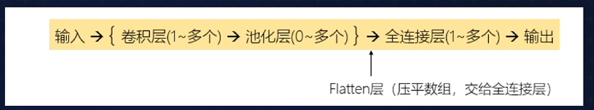
## 7.1 LeNet-5
### 7.1.1 结构图
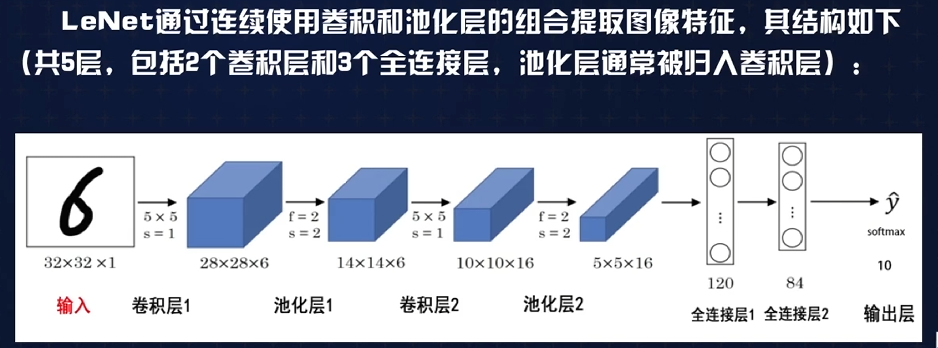
### 7.1.2 网络说明
    输入：32*32*1 的弧度图像
    卷积层1：卷积核大小5*5 数量6 步长1，激活函数一般用relu，得到特征图28*28*6 
    池化层1： 大小2*2，步长2，特征图变为14*14*6
    卷积层2： 卷积核大小5*5 数量16  步长1，激活函数一般用relu，得到特征图10*10*16
    池化层2： 大小2*2，步长2，特征图变为5*5*16
    然后，将池化层2的输出展开（压平），得到长度为400的向量（5*5*16=400）
    经过第1个全连接层，输出长度为120的向量
    经过第2个全连接层，输出长度为84的向量
    最后送入softmax输出层，得到每个类别对应的概率值
### 7.1.3 优缺点
    在小规模数据集上表现良好，至今依然被广泛使用，面对更大规模的数据集则需要更复杂的网络
## 7.2 AlexNet
### 7.2.1 结构图
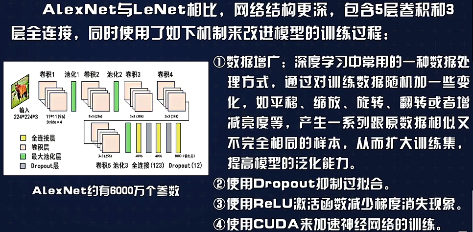

## 7.3 VGGNet（VGG-16）
### 7.3.1 结构图

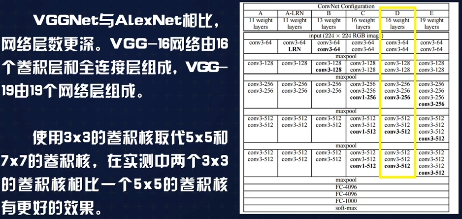
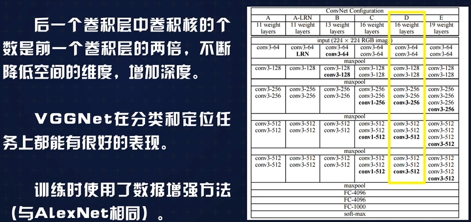
## 7,4 ResNet（残差网络）
### 7.4.1 神经网络的“退化”问题
    当模型层数增加到某种程度时，模型的准确性会不升反降。这种现象被称为网络的“退化”（Degradation）。
    神经网络退化的主要原因是由反向传播算法中多层复合函数求导引起的梯度消失/梯度爆炸现象，导致网络难以收敛
### 7.4.2 原理
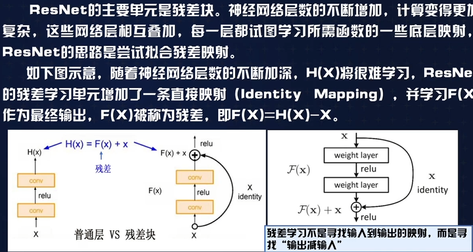

# 八、 循环神经网络的结构和特点
## 8.1 循环神经网络的机制
    1。 与经典的全连接网络相比，循环神经网络的隐藏层多了一个“回路”。S是隐藏层的值，U是输入层到隐藏层的权重矩阵，V是隐藏层到输出层的权重矩阵，权重矩阵
        W是隐藏层上一次的值
    2. 在RNN中，隐藏层的值不仅由上一次的输出决定，还由网络的上一个状态决定。通过这一机制RNN具备了某种“记忆”功能
## 8.2 循环神经网络与经典的全连接网络比较
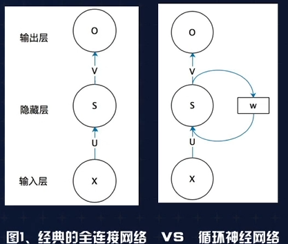
## 8.3 示意图
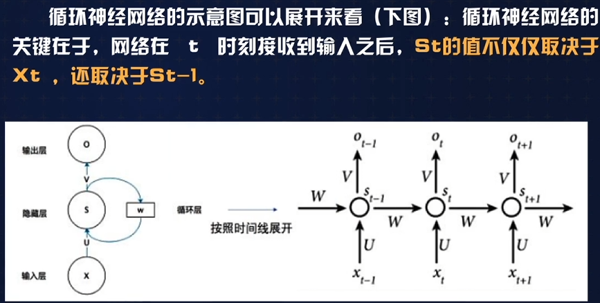
## 8.4 计算方法
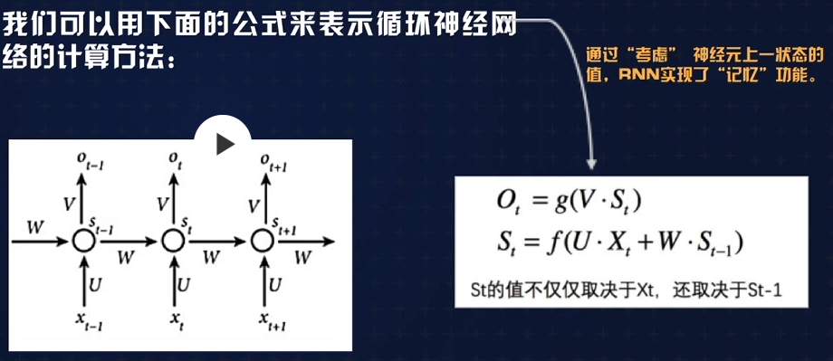
## 8.5 长短记忆网络（LSTM）
### 8.5.1 梯度消失与梯度爆炸
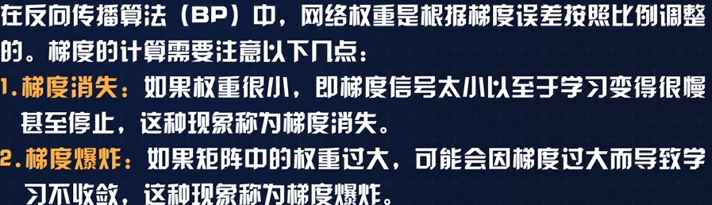
### 8.5.2 机制
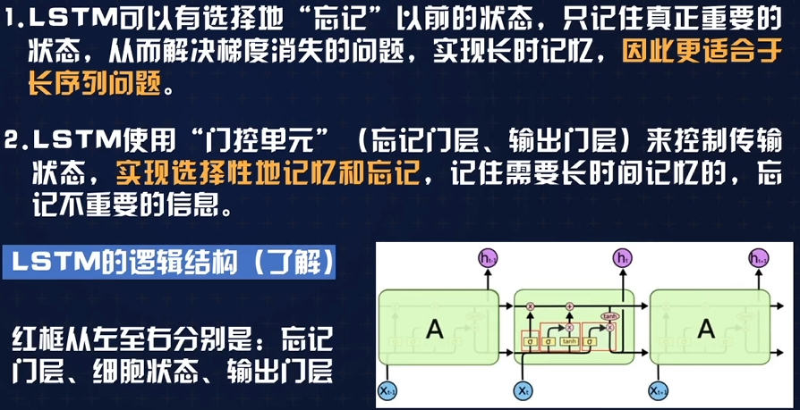 
    

# 九、 自然语言处理（NLP）及NLTK（自然语言工具库）
## 9.1 安装NLTK,下载语料库
    pip install nltk
    import nltk
    nltk.download() # 下载语料库
## 9.2 了解NLTK的主要功能模块

## 9.3 词频统计、分词与分句、去停用词、词干提取、词性标注、WordNet词集等功能示例
### 词频统计
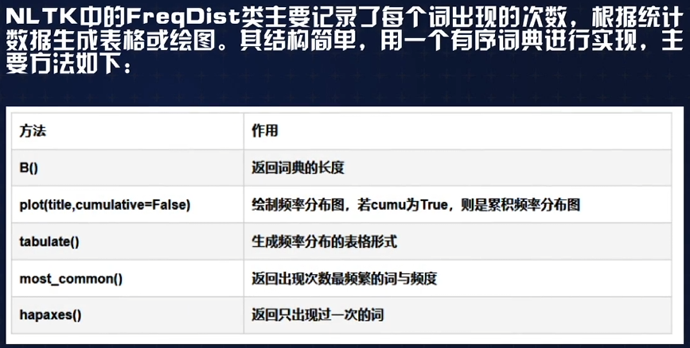
### 去停用词
    在自然语言处理中，一些不含有用信息的词如the，to，the，a，an，and等被称为停用词，在建模之前通常需要将它们去掉。注意:不同的语言有不同的停用词表。
### 词干提取
    单词的词干提取指的是从单词中去除词缀并返回词根(如working 的词干是 work、cars的词干是car)。
    在搜索中经常使用这种技术--用户通过同一个单词的不同形式进行搜索，返回的都是相同的。常用的词干提取算法是 Porter，
    NLTK 中封装了PorterStemmer 类来实现。
### 词性标注    
    标注出是形容词、动词、名词、副词等词性
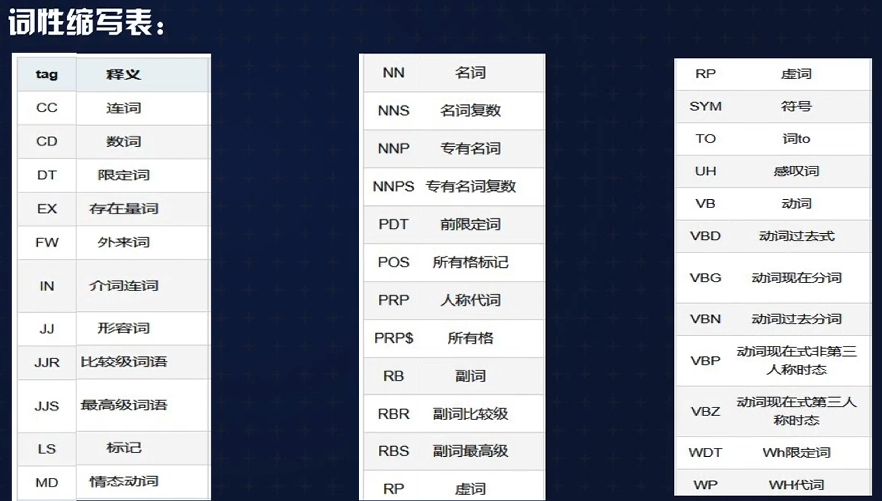
### 使用wordnet获取单词的词集
    wordnet是NLTK内置的一个自然语言库，可以得到指定单词的词集，包括释义、例句、近义词、反义词等等。

